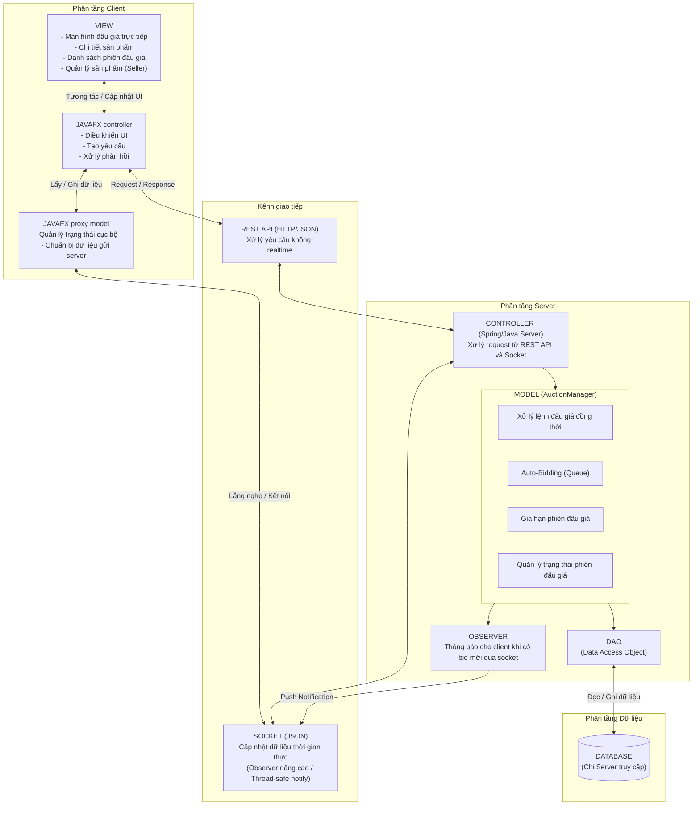

```mermaid
graph TD
    subgraph ClientLayer [Phân tầng Client]
        View["VIEW<br>- Màn hình đấu giá trực tiếp<br>- Chi tiết sản phẩm<br>- Danh sách phiên đấu giá<br>- Quản lý sản phẩm (Seller)"]
        ControllerFX["JAVAFX controller<br>- Điều khiển UI<br>- Tạo yêu cầu<br>- Xử lý phản hồi"]
        ModelFX["JAVAFX proxy model<br>- Quản lý trạng thái cục bộ<br>- Chuẩn bị dữ liệu gửi server"]
        
        View <-->|Tương tác / Cập nhật UI| ControllerFX
        ControllerFX <-->|Lấy / Ghi dữ liệu| ModelFX
    end

    subgraph Network [Kênh giao tiếp]
        REST["REST API (HTTP/JSON)<br>Xử lý yêu cầu không realtime"]
        Socket["SOCKET (JSON)<br>Cập nhật dữ liệu thời gian thực<br>(Observer nâng cao / Thread-safe notify)"]
    end

    subgraph ServerLayer [Phân tầng Server]
        ControllerSrv["CONTROLLER (Spring/Java Server)<br>Xử lý request từ REST API và Socket"]
        
        subgraph ModelServer ["MODEL (AuctionManager)"]
            Logic1["Xử lý lệnh đấu giá đồng thời"]
            Logic2["Auto-Bidding (Queue)"]
            Logic3["Gia hạn phiên đấu giá"]
            Logic4["Quản lý trạng thái phiên đấu giá"]
        end
        
        ObserverSrv["OBSERVER<br>Thông báo cho client khi có bid mới qua socket"]
        DAO["DAO<br>(Data Access Object)"]
    end

    subgraph DataLayer [Phân tầng Dữ liệu]
        DB[("DATABASE<br>(Chỉ Server truy cập)")]
    end

    %% Luồng kết nối mạng
    ControllerFX <-->|Request / Response| REST
    ModelFX <-->|Lắng nghe / Kết nối| Socket
    
    REST <--> ControllerSrv
    ControllerSrv <--> Socket
    
    %% Luồng nội bộ Server
    ControllerSrv --> ModelServer
    ModelServer --> ObserverSrv
    ObserverSrv -->|Push Notification| Socket
    
    ModelServer --> DAO 
    
    %% Luồng Database an toàn
    DAO <-->|Đọc / Ghi dữ liệu| DB
```
