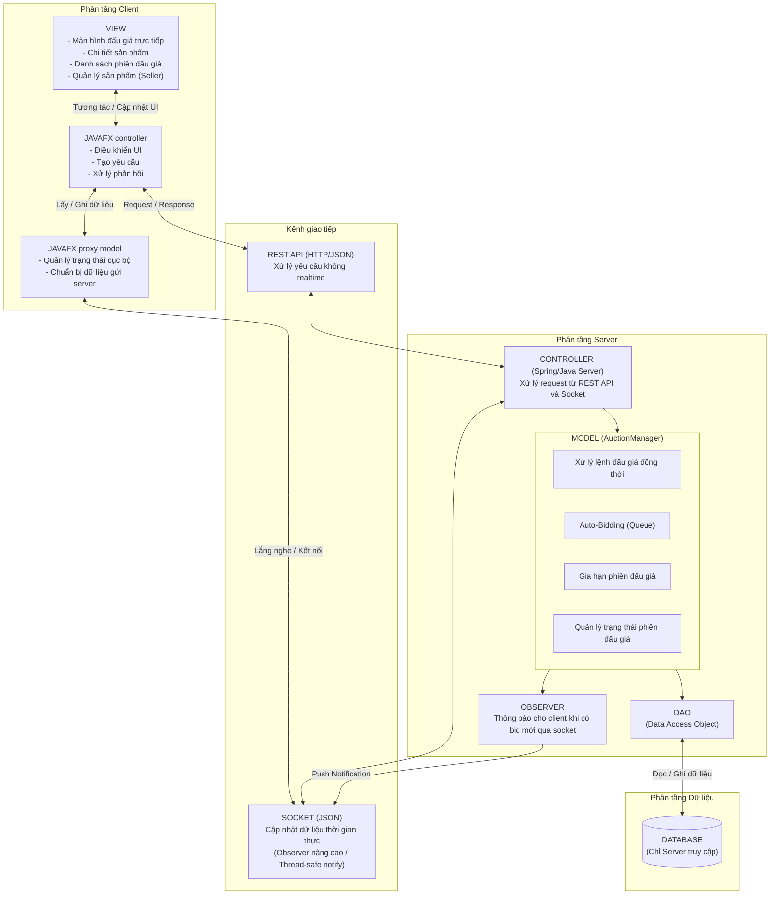
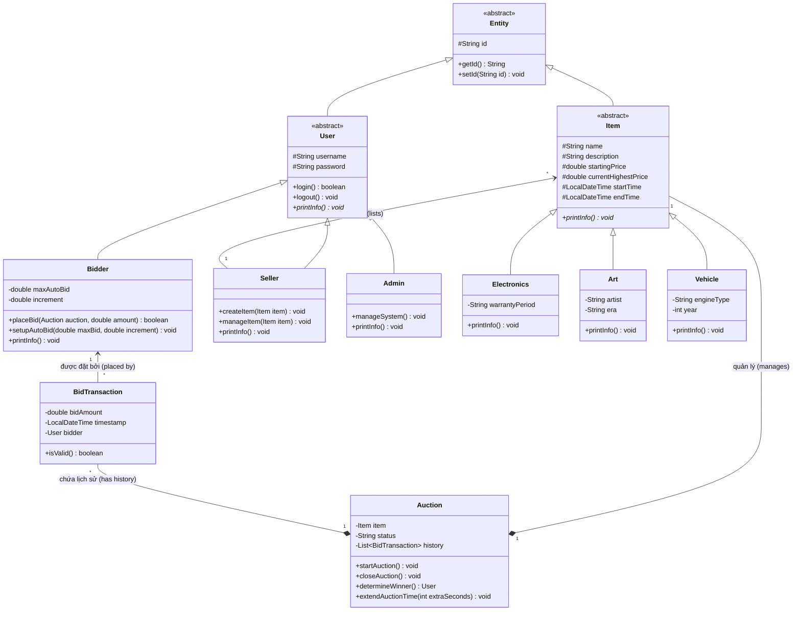

```mermaid
graph TD
    subgraph ClientLayer [Phân tầng Client]
        View["VIEW<br>- Màn hình đấu giá trực tiếp<br>- Chi tiết sản phẩm<br>- Danh sách phiên đấu giá<br>- Quản lý sản phẩm (Seller)"]
        ControllerFX["JAVAFX controller<br>- Điều khiển UI<br>- Tạo yêu cầu<br>- Xử lý phản hồi"]
        ModelFX["JAVAFX proxy model<br>- Quản lý trạng thái cục bộ<br>- Chuẩn bị dữ liệu gửi server"]
        
        View <-->|Tương tác / Cập nhật UI| ControllerFX
        ControllerFX <-->|Lấy / Ghi dữ liệu| ModelFX
    end

    subgraph Network [Kênh giao tiếp]
        REST["REST API (HTTP/JSON)<br>Xử lý yêu cầu không realtime"]
        Socket["SOCKET (JSON)<br>Cập nhật dữ liệu thời gian thực<br>(Observer nâng cao / Thread-safe notify)"]
    end

    subgraph ServerLayer [Phân tầng Server]
        ControllerSrv["CONTROLLER (Spring/Java Server)<br>Xử lý request từ REST API và Socket"]
        
        subgraph ModelServer ["MODEL (AuctionManager)"]
            Logic1["Xử lý lệnh đấu giá đồng thời"]
            Logic2["Auto-Bidding (Queue)"]
            Logic3["Gia hạn phiên đấu giá"]
            Logic4["Quản lý trạng thái phiên đấu giá"]
        end
        
        ObserverSrv["OBSERVER<br>Thông báo cho client khi có bid mới qua socket"]
        DAO["DAO<br>(Data Access Object)"]
    end

    subgraph DataLayer [Phân tầng Dữ liệu]
        DB[("DATABASE<br>(Chỉ Server truy cập)")]
    end

    %% Luồng kết nối mạng
    ControllerFX <-->|Request / Response| REST
    ModelFX <-->|Lắng nghe / Kết nối| Socket
    
    REST <--> ControllerSrv
    ControllerSrv <--> Socket
    
    %% Luồng nội bộ Server
    ControllerSrv --> ModelServer
    ModelServer --> ObserverSrv
    ObserverSrv -->|Push Notification| Socket
    
    ModelServer --> DAO 
    
    %% Luồng Database an toàn
    DAO <-->|Đọc / Ghi dữ liệu| DB
```

``` mermaid
classDiagram
    direction BT
    
    %% Lớp cơ sở (Abstraction)
    class Entity {
        <<abstract>>
        #String id
        +getId() String
        +setId(String id) void
    }
    
    %% Phân cấp User (Inheritance)
    class User {
        <<abstract>>
        #String username
        #String password
        +login() boolean
        +logout() void
        +printInfo()* void
    }
    
    class Bidder {
        -double maxAutoBid
        -double increment
        +placeBid(Auction auction, double amount) boolean
        +setupAutoBid(double maxBid, double increment) void
        +printInfo() void
    }
    
    class Seller {
        +createItem(Item item) void
        +manageItem(Item item) void
        +printInfo() void
    }
    
    class Admin {
        +manageSystem() void
        +printInfo() void
    }
    
    %% Phân cấp Item (Inheritance)
    class Item {
        <<abstract>>
        #String name
        #String description
        #double startingPrice
        #double currentHighestPrice
        #LocalDateTime startTime
        #LocalDateTime endTime
        +printInfo()* void
    }
    
    class Electronics {
        -String warrantyPeriod
        +printInfo() void
    }
    
    class Art {
        -String artist
        -String era
        +printInfo() void
    }
    
    class Vehicle {
        -String engineType
        -int year
        +printInfo() void
    }
    
    %% Quản lý đấu giá
    class Auction {
        -Item item
        -String status
        -List~BidTransaction~ history
        +startAuction() void
        +closeAuction() void
        +determineWinner() User
        +extendAuctionTime(int extraSeconds) void
    }
    
    class BidTransaction {
        -double bidAmount
        -LocalDateTime timestamp
        -User bidder
        +isValid() boolean
    }
    
    %% Định nghĩa các mối quan hệ (Relationships)
    User --|> Entity
    Item --|> Entity
    
    Bidder --|> User
    Seller --|> User
    Admin --|> User
    
    Electronics --|> Item
    Art --|> Item
    Vehicle --|> Item
    
    Auction "1" *-- "1" Item : quản lý (manages)
    Auction "1" *-- "*" BidTransaction : chứa lịch sử (has history)
    BidTransaction "*" --> "1" Bidder : được đặt bởi (placed by)
    Seller "1" --> "*" Item : đăng bán (lists)
```
